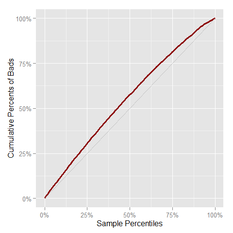

# Risk
A R package for make simple the common tasks for validation of models and scores.

## Installation
You can install `Risk` from `github` using the `devtools` package.


```r
if (!require("devtools"))
  install.packages("devtools")
devtools::install_github("jbkunst/Risk")
```

## Valdation

This package assume the label for loan of clients is: `1` for a good characteristic, `0` otherwise. 


```r
data(predictions)
head(predictions)
```

```
##    score label
## 1 0.7977     0
## 2 0.1942     0
## 3 0.4866     0
## 4 0.9475     1
## 5 0.6712     0
## 6 0.7543     1
```

```r
score <- predictions$score*1000
label <- predictions$label

# Some indicators
ks(score, label)
```

```
## [1] 0.2544
```

```r
aucroc(score, label)
```

```
## [1] 0.6765
```

```r
# A lot of indicators
score_indicators(score, label)
```

```
##    Size Goods Bads BadRate     KS AUCROC   Gini Divergence Gain10 Gain20
## 1 10000  3010 6990   0.699 0.2544 0.6765 0.3529     0.4077  0.127 0.2471
##   Gain30 Gain40 Gain50
## 1 0.3619 0.4725 0.5763
```

```r
# Odds Table
oddstable(score, label)
```

```
##         Class Freq FreqRel FreqRelAcum FreqRelDesAcum FreqBad FreqRelBad
## 1  [3.89,152] 1000     0.1         0.1            1.0     888    0.12704
## 2   (152,262] 1000     0.1         0.2            0.9     839    0.12003
## 3   (262,370] 1000     0.1         0.3            0.8     803    0.11488
## 4   (370,474] 1000     0.1         0.4            0.7     773    0.11059
## 5   (474,570] 1000     0.1         0.5            0.6     725    0.10372
## 6   (570,669] 1000     0.1         0.6            0.5     697    0.09971
## 7   (669,761] 1000     0.1         0.7            0.4     638    0.09127
## 8   (761,836] 1000     0.1         0.8            0.3     622    0.08898
## 9   (836,909] 1000     0.1         0.9            0.2     580    0.08298
## 10  (909,999] 1000     0.1         1.0            0.1     425    0.06080
##    FreqRelBadAcum FreqRelBadDesAcum BadRate BadRateAcum BadRateDesacum
## 1          0.1270            1.0000   0.888      0.8880         0.6990
## 2          0.2471            0.8730   0.839      0.8635         0.6780
## 3          0.3619            0.7529   0.803      0.8433         0.6579
## 4          0.4725            0.6381   0.773      0.8257         0.6371
## 5          0.5763            0.5275   0.725      0.8056         0.6145
## 6          0.6760            0.4237   0.697      0.7875         0.5924
## 7          0.7672            0.3240   0.638      0.7661         0.5663
## 8          0.8562            0.2328   0.622      0.7481         0.5423
## 9          0.9392            0.1438   0.580      0.7294         0.5025
## 10         1.0000            0.0608   0.425      0.6990         0.4250
##      Odds
## 1  0.1261
## 2  0.1919
## 3  0.2453
## 4  0.2937
## 5  0.3793
## 6  0.4347
## 7  0.5674
## 8  0.6077
## 9  0.7241
## 10 1.3529
```

```r
oddstable(score, label, breaks = 0:5*200)
```

```
##         Class Freq FreqRel FreqRelAcum FreqRelDesAcum FreqBad FreqRelBad
## 1     (0,200] 1453  0.1453      0.1453         1.0000    1272     0.1820
## 2   (200,400] 1813  0.1813      0.3266         0.8547    1465     0.2096
## 3   (400,600] 2047  0.2047      0.5313         0.6734    1500     0.2146
## 4   (600,800] 2176  0.2176      0.7489         0.4687    1443     0.2064
## 5 (800,1e+03] 2511  0.2511      1.0000         0.2511    1310     0.1874
##   FreqRelBadAcum FreqRelBadDesAcum BadRate BadRateAcum BadRateDesacum
## 1         0.1820            1.0000  0.8754      0.8754         0.6990
## 2         0.3916            0.8180  0.8081      0.8380         0.6690
## 3         0.6062            0.6084  0.7328      0.7975         0.6316
## 4         0.8126            0.3938  0.6631      0.7584         0.5874
## 5         1.0000            0.1874  0.5217      0.6990         0.5217
##     Odds
## 1 0.1423
## 2 0.2375
## 3 0.3647
## 4 0.5080
## 5 0.9168
```

```r
# Confussion matrix
conf_matrix(ifelse(score<500, 0, 1), label)
```

```
## $confusion.matrix
##     prediction
## true    0    1
##    0 3510 3480
##    1  779 2231
## 
## $Accuracy
## [1] 0.5741
## 
## $`True Positive rate (BB)`
## [1] 0.7412
## 
## $`False Positive rate`
## [1] 0.4979
## 
## $`True Negative rate (MM)`
## [1] 0.5021
## 
## $`False Negative rate`
## [1] 0.2588
## 
## $Precision
## [1] 0.3906
```


## Ploting

```r
plot_roc(score, label)
```

 

```r
plot_gain(score, label)
```

 
