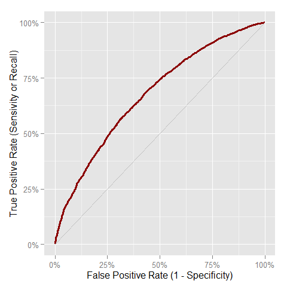

# Risk
A R package for make simple the common tasks for validation of models and scores.

## Installation
You can install `Risk` from `github` using the `devtools` package.


```r
if (!require("devtools"))
  install.packages("devtools")
devtools::install_github("jbkunst/Risk")
```

## Some Functions

This package assume the label for loan of clients is: `1` for a good characteric, `0` otherwise. 


```r
data(predictions)
head(predictions)
```

```
##    score label
## 1 0.7977     0
## 2 0.1942     0
## 3 0.4866     0
## 4 0.9475     1
## 5 0.6712     0
## 6 0.7543     1
```

```r
score <- predictions$score*1000
label <- predictions$label

# Some indicators
ks(score, label)
```

```
## [1] 0.2544
```

```r
aucroc(score, label)
```

```
## [1] 0.6765
```

```r
# A lot of indicators
score_indicators(score, label)
```

```
##    Size Goods Bads BadRate     KS AUCROC   Gini Divergence Gain10 Gain20
## 1 10000  3010 6990   0.699 0.2544 0.6765 0.3529     0.4077  0.127 0.2471
##   Gain30 Gain40 Gain50
## 1 0.3619 0.4725 0.5763
```

```r
# Odds Table
oddstable(score, label)
```

```
##         Class Freq FreqRel FreqRelAcum FreqRelDesAcum FreqBad FreqRelBad
## 1  [3.89,103]  594  0.0594      0.0594         1.0000     541    0.07740
## 2   (103,203]  880  0.0880      0.1474         0.9406     750    0.10730
## 3   (203,302]  904  0.0904      0.2378         0.8526     749    0.10715
## 4   (302,402]  910  0.0910      0.3288         0.7622     714    0.10215
## 5   (402,501] 1015  0.1015      0.4303         0.6712     768    0.10987
## 6   (501,601] 1022  0.1022      0.5325         0.5697     722    0.10329
## 7   (601,700] 1010  0.1010      0.6335         0.4675     700    0.10014
## 8   (700,800] 1153  0.1153      0.7488         0.3665     735    0.10515
## 9   (800,899] 1386  0.1386      0.8874         0.2512     808    0.11559
## 10  (899,999] 1126  0.1126      1.0000         0.1126     503    0.07196
##    FreqRelBadAcum FreqRelBadDesAcum BadRate BadRateAcum BadRateDesacum
## 1          0.0774           1.00000  0.9108      0.9108         0.6990
## 2          0.1847           0.92260  0.8523      0.8758         0.6856
## 3          0.2918           0.81531  0.8285      0.8579         0.6684
## 4          0.3940           0.70815  0.7846      0.8376         0.6494
## 5          0.5039           0.60601  0.7567      0.8185         0.6311
## 6          0.6072           0.49614  0.7065      0.7970         0.6087
## 7          0.7073           0.39285  0.6931      0.7804         0.5874
## 8          0.8124           0.29270  0.6375      0.7584         0.5583
## 9          0.9280           0.18755  0.5830      0.7310         0.5219
## 10         1.0000           0.07196  0.4467      0.6990         0.4467
##       Odds
## 1  0.09797
## 2  0.17333
## 3  0.20694
## 4  0.27451
## 5  0.32161
## 6  0.41551
## 7  0.44286
## 8  0.56871
## 9  0.71535
## 10 1.23857
```

```r
oddstable(score, label, breaks = 0:5*200)
```

```
##         Class Freq FreqRel FreqRelAcum FreqRelDesAcum FreqBad FreqRelBad
## 1     (0,200] 1453  0.1453      0.1453         1.0000    1272     0.1820
## 2   (200,400] 1813  0.1813      0.3266         0.8547    1465     0.2096
## 3   (400,600] 2047  0.2047      0.5313         0.6734    1500     0.2146
## 4   (600,800] 2176  0.2176      0.7489         0.4687    1443     0.2064
## 5 (800,1e+03] 2511  0.2511      1.0000         0.2511    1310     0.1874
##   FreqRelBadAcum FreqRelBadDesAcum BadRate BadRateAcum BadRateDesacum
## 1         0.1820            1.0000  0.8754      0.8754         0.6990
## 2         0.3916            0.8180  0.8081      0.8380         0.6690
## 3         0.6062            0.6084  0.7328      0.7975         0.6316
## 4         0.8126            0.3938  0.6631      0.7584         0.5874
## 5         1.0000            0.1874  0.5217      0.6990         0.5217
##     Odds
## 1 0.1423
## 2 0.2375
## 3 0.3647
## 4 0.5080
## 5 0.9168
```

```r
# For Plotting
plot_roc(score, label)
```

 

```r
plot_gain(score, label)
```

 

```r
# Confussion matrix
conf_matrix(ifelse(score<500, 0, 1), label)
```

```
## $confusion.matrix
##     prediction
## true    0    1
##    0 3510 3480
##    1  779 2231
## 
## $Accuracy
## [1] 0.5741
## 
## $`True Positive rate (BB)`
## [1] 0.7412
## 
## $`False Positive rate`
## [1] 0.4979
## 
## $`True Negative rate (MM)`
## [1] 0.5021
## 
## $`False Negative rate`
## [1] 0.2588
## 
## $Precision
## [1] 0.3906
```
